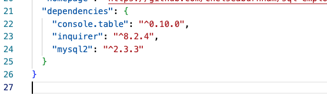

# sql-employee-tracker

##  Description
This application uses sql and inquirer to prompt the user for information on employees. You are able to view a list of employees, roles, and departments as a table and add employees, roles, and departments. You are also able to update an employee if their role changes. All of this is using mysql to create an employee database and tables for each item. 

##  Table of Contents
* [Installation](#installation)
* [Usage](#usage)
* [License](#license)
* [Contributing](#contributing)
* [Questions](#questions)

##  Installation
Inquirer, mysql, and console.table must be installed to run the tests and prompts.  

##  Usage
Here is a [Video Walkthrough](https://watch.screencastify.com/v/AkFJh5sK0aMFJTJNd8jH) of how this application can be used. 

## License
This is licensed under the MIT license.

##  Contributing
[w3schools](https://www.w3schools.com/) 
[Stack Overflow](https://stackoverflow.com/?newreg=8cd9776f072c449eac02d1ab363597c8)

##  Questions
If you have any questions about the repo, feel free to email me at chelseaburnham0@gmail.com. You can find more of my work at [http://github.com/chelseaburnham].